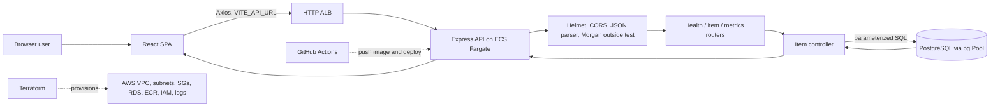

# Project Context: Cloud-Native AWS Application

This document describes the checked-in implementation in this repository as inspected on 2026-09-30. Source and executable configuration are the primary evidence. README/tutorial material and screenshots may describe prior manual work or goals; they do not by themselves prove current AWS resources or deployed behavior. No secret values are included.

## 1. Project Overview

**Name:** Cloud-Native AWS Application (Terraform defaults use `cloudapp`).

**Quick view:** This is a small full-stack item-list application: a React/Vite single-page frontend calls a Node.js/Express JSON API, which reads/writes named rows in PostgreSQL. Docker Compose initializes a fresh local DB and runs all three tiers. Terraform defines a VPC, private RDS, ECR, an HTTP ALB, ECS Fargate backend, task IAM roles, Secrets Manager credentials, and CloudWatch logs. GitHub Actions tests and deploys backend images to ECS using OIDC credentials. The backend is one Express app; this is not a microservices system.

**Purpose and problem:** The implemented product behavior is basic item creation and listing. The repository presents the project as a cloud engineering/DevOps learning and deployment project. Actual audience, production status, live deployment state, and whether the infrastructure has been applied are **UNKNOWN / NOT VERIFIED** from source alone.

**Implemented features:** list/create items, DB-aware health/readiness response, process metrics, PostgreSQL pooling and fresh-DB schema, request validation, frontend loading/error displays, backend Jest/Supertest tests, Dockerfiles/Compose, Terraform AWS infrastructure, and backend ECS deployment workflow.

**Not implemented in the app code:** user accounts, authentication, authorization, roles, update/delete item operations, AI/ML/RAG, frontend metrics/health views, application service layer, database migration/seed scripts, or frontend automated tests.

## 2. Repository Structure

```text
.
├── .github/workflows/deploy.yml     # CI/deploy workflow for backend image to ECS
├── backend/                         # Express API, PostgreSQL access, tests, Dockerfile
│   ├── server.js                    # Starts HTTP listener
│   ├── src/app.js                   # Middleware and route composition
│   ├── src/config/env.js            # dotenv and environment configuration
│   ├── src/controllers/             # Item request handlers and SQL calls
│   ├── src/db/index.js              # pg Pool
│   ├── src/db/schema.sql            # Fresh database items table bootstrap
│   ├── src/middleware/              # Validation response and error handler
│   ├── src/routes/                  # Health, item, and metrics routes
│   ├── src/validators/              # Item name validation rules
│   └── tests/                       # Health and item API tests
├── frontend/                        # React 19 + Vite SPA
│   ├── Dockerfile                   # Vite build served by Nginx
│   ├── nginx.conf                   # SPA route fallback
│   ├── src/main.jsx                 # React entry point and BrowserRouter
│   ├── src/App.jsx                  # Client route table
│   ├── src/pages/                   # Home/dashboard page and item state
│   ├── src/components/              # ItemForm and ItemList
│   ├── src/api/                     # Item endpoint functions
│   └── src/services/                # Axios instance
├── terraform/                       # AWS provider, root composition and modules
│   └── modules/{networking,security,database,compute}/
├── docs/                            # Images/screenshots and deployment-steps.md
├── docker-compose.yml               # PostgreSQL, backend, and Nginx frontend
├── instruction.md                   # Long tutorial/roadmap (not runtime configuration)
├── README.md                        # Project overview and deployment claims
├── package.json                     # Root package declares Jest only
└── context.md                       # This source-oriented context document
```

Package lockfiles are present at root, backend, and frontend. Generated dependency directories are excluded from this map. `docs/` contains architecture/deployment screenshots; screenshots are not a substitute for current infrastructure code. `frontend/public/` contains static icons. `.gitignore` files exclude dependencies, environment files, build output, logs, and Terraform state/variable files.

## 3. Technology Stack

Versions below are declared ranges or image tags in checked-in manifests, not necessarily the exact installed/runtime versions.

| Layer | Technology | Version | Purpose |
|---|---|---|---|
| Frontend | React / React DOM | `^19.2.6` | SPA UI |
| Frontend build | Vite, `@vitejs/plugin-react` | `^8.0.12`, `^6.0.1` | Dev server and production build |
| Frontend routing | React Router DOM | `^7.15.1` | Browser-side route `/` |
| Frontend HTTP | Axios | `^1.16.1` | Calls JSON API |
| Styling | CSS | No framework declared | Global/base styles |
| Backend | Node.js | Docker image `node:20-alpine`; other runtime version not pinned in manifests | JavaScript runtime |
| Backend HTTP | Express | `^5.2.1` | API server and routing |
| Database | PostgreSQL / `pg` | Compose image `postgres:18.4`; Terraform engine `15`; `pg` `^8.21.0` | Relational item storage and connection pool |
| Backend middleware | cors, helmet, morgan, express-validator, dotenv | package ranges in `backend/package.json` | CORS, security headers, request logging, validation, env loading |
| Backend tests | Jest, Supertest | `^30.4.2`, `^7.2.2` | API tests |
| Containers | Docker, Docker Compose | Not pinned in repository | Local container definitions and backend/frontend images |
| Infrastructure as code | Terraform AWS provider / random provider | `~> 5.0` / `~> 3.6`; Terraform `>= 1.5` | VPC, security groups, RDS, ECR, ALB, ECS, IAM and logging |
| Deployment workflow | GitHub Actions | Workflow actions use listed tags | Backend test, ECR image push, ECS service deploy |
| Cloud | AWS | Services represented in Terraform/workflow: VPC, IGW, NAT GW, SG, RDS, Secrets Manager, ECR, ECS, ALB, IAM, CloudWatch | Infrastructure/deployment target |
| Authentication / AI | None found | — | No auth or AI/ML implementation present |

## 4. Architecture and Request Flow



The browser loads the Vite-built SPA. `HomePage` calls `getItems()` once on mount. `itemsApi.js` uses a shared Axios instance whose `baseURL` is `import.meta.env.VITE_API_URL` (falling back to localhost:3000); it requests `GET /api/items/getitems`. On form submit it calls `POST /api/items/createitems` with `{name}`. Express parses JSON, applies Helmet and permissive default CORS, and dispatches to the item router. The controller executes SQL through a shared `pg.Pool`; results are JSON-encoded and Axios returns the `data` field to React state. For an AWS-hosted browser build, `VITE_API_URL` should be the ALB origin; frontend hosting is not provisioned here.

`backend/src/db/schema.sql` creates `items(id BIGINT GENERATED BY DEFAULT AS IDENTITY PRIMARY KEY, name VARCHAR(100) NOT NULL)`. Compose mounts this into PostgreSQL's init directory for a fresh volume. Terraform does not execute the schema against RDS; initialize a new AWS database once before item operations.

Terraform and GitHub Actions are separate from runtime request processing. Terraform creates networking/security, private RDS, ECR, ALB, ECS/Fargate, task IAM roles, Secrets Manager credentials, and CloudWatch logs. GitHub Actions deploys backend image revisions. Frontend hosting remains outside Terraform.

## 5. Frontend

- **Entry/routing:** `frontend/index.html` provides `#root` and loads `/src/main.jsx`; `main.jsx` imports `styles/global.css`, mounts `<App>` under `<BrowserRouter>`. `App.jsx` defines only `/` → `HomePage`. `index.html` also has a literal `Hello there from AWS` heading after `#root`, independent of React rendering.
- **Page/state:** `HomePage` owns `items`, `loading`, and `error` via `useState`. An empty-dependency `useEffect` requests items at initial mount. While loading it renders `Loading items...`; any fetch error switches to `Failed to fetch items`. Create errors set `Failed to create item`; because the component returns only the error paragraph when `error` is nonempty, either failure replaces the main UI and no retry control is shown. Successful creation appends returned item to current state.
- **Form:** `ItemForm({onAdd})` owns the input string, trims it, ignores blank values, calls `onAdd({name: trimmedName})`, and clears the input immediately. It does not await the request or disable during submission. Backend validation additionally requires 2–100 characters.
- **List:** `ItemList({items})` renders each `item.name`, keyed by `item.id`; no empty-state message or mutation controls.
- **API:** `services/api.js` creates Axios with `baseURL: import.meta.env.VITE_API_URL || "http://localhost:3000"`. `api/itemsApi.js` exposes `getItems()` and `createItem(item)`, returning `response.data.data`. No auth headers, interceptors, timeout, retry, or custom response error mapping are configured.
- **Styling:** `src/index.css` contains design tokens, responsive typography and root layout; `src/styles/global.css` contains basic body/input/button styles. `main.jsx` imports only `global.css`, so `index.css` is not imported by the shown entry path and its rules are not applied unless imported elsewhere (no such import found).
- **Build/config/dependencies:** Vite uses the React plugin and no proxy configuration. `VITE_API_URL` is the only frontend env reference found. Frontend scripts: `npm run dev`, `npm run build`, `npm run lint`, `npm run preview`. No frontend test framework/config found.

## 6. Backend

### Initialization and modules

`backend/server.js` imports the Express app and configured port, then calls `app.listen`. `src/app.js` configures middleware in this order: Helmet, `cors()` defaults, `express.json()`, Morgan `dev` logging except when `NODE_ENV === "test"`, root JSON response, mounted routers, then error handler. App is exported separately to permit Supertest without binding a port.

`src/config/env.js` loads dotenv and exports `nodeEnv`, `port`, and DB settings. `src/db/index.js` builds one `pg.Pool`, logs connect/error events, and exports it. Controllers directly perform SQL; there is no service/model layer.

### Endpoints

#### `GET /`
- Purpose: API-running message.
- Authentication: None.
- Request/validation: No parameters or body.
- Controller/service/database/external calls: Inline in `src/app.js`; no DB or external calls.
- Response: `200 {"message":"Backend API running successfully"}`.
- Errors: No route-specific handling.

#### `GET /health`
- Purpose: Application and database readiness response.
- Authentication: None.
- Request/validation: None.
- Controller/service/database/external calls: Inline in `healthRoutes.js`; runs `SELECT 1` through the PostgreSQL pool.
- Response: `200 {status:"OK", uptime:<process.uptime number>, timestamp:<Date>}`.
- Errors: `503 {status:"UNAVAILABLE",message:"Database is unavailable"}` when the DB query fails.

#### `GET /api/items/getitems`
- Purpose: Retrieve all rows from `items`.
- Authentication: None.
- Request/validation: None.
- Controller: `getItems` in `controllers/itemController.js`.
- Service: None.
- Database: `pool.query("SELECT * FROM items")`; no ordering or pagination.
- External API: None.
- Response: `200 {success:true,count:<rows length>,data:<rows>}`.
- Errors: Catches DB/query exception, logs it, returns `500 {error:"Internal Server Error"}`.

#### `POST /api/items/createitems`
- Purpose: Insert a named item.
- Authentication: None.
- Request body: JSON `{ "name": string }`.
- Validation: `express-validator` trims name, requires nonempty, and enforces length 2–100 inclusive; validation middleware responds `400 {success:false,errors:[...]}`. Empty JSON/non-string input validation behavior follows express-validator and has no separate schema layer.
- Controller: `createItems` in `controllers/itemController.js`.
- Service: None.
- Database: Parameterized `INSERT INTO items (name) VALUES ($1) RETURNING *` with `[name]`.
- External API: None.
- Response: `201 {success:true,data:<inserted row>}`.
- Errors: Controller passes DB error to global handler; generic `500 {success:false,message:"Internal Server Error"}`.

#### `GET /api/metrics`
- Purpose: Process metrics snapshot.
- Authentication: None.
- Request/validation: None.
- Controller/service/database/external calls: Inline in `metricRoutes.js`; uses `process.uptime()`, `process.memoryUsage()`, current `Date`.
- Response: `200 {uptime,memoryUsage,timestamp}`.
- Errors: No explicit route-specific handling.

### Middleware and error behavior

`validate.js` checks express-validator results and returns 400 on any errors. `errorHandler.js` logs the error and returns a generic 500. It does not branch on status, expose request IDs, or set a specific 404 handler. The GET items route has its own 500 response shape; POST uses the global shape. CORS uses the library default, which allows broad origins; no origin allowlist is configured.

## 7. Database

- **Technology/connection:** PostgreSQL through `pg` `Pool`, configured from `DB_HOST`, `DB_PORT`, `DB_USER`, `DB_PASSWORD`, and `DB_NAME` in `src/config/env.js`.
- **TLS:** `DB_SSL === "false"` disables SSL. Otherwise an SSL object `{rejectUnauthorized:false}` is used. This is the code default, including when the variable is unset.
- **Schema:** `backend/src/db/schema.sql` creates one table: `id BIGINT GENERATED BY DEFAULT AS IDENTITY PRIMARY KEY`, `name VARCHAR(100) NOT NULL`. Compose runs it for a fresh volume; RDS initialization is a manual one-time operation. No ORM or migration framework exists.
- **Queries:** `SELECT * FROM items`; parameterized insert `INSERT INTO items (name) VALUES ($1) RETURNING *`. No ordering or pagination.
- **Infrastructure:** Terraform creates an RDS PostgreSQL 15 instance (`db.t3.micro`, 20 GB gp3, encrypted, 7-day backups, `multi_az=false`, `publicly_accessible=false`) and a DB subnet group. Docker Compose uses `postgres:18.4` locally, so local/AWS engine versions differ.

## 8. Authentication and Authorization

No registration/login routes, password handling, JWT/session code, auth middleware, roles, permissions, protected frontend routes, or logout/refresh behavior were found. All checked-in API endpoints are unauthenticated. Do not assume AWS network controls equate to application-level authorization.

## 9. AI / ML / RAG

No AI/ML/LLM, embedding, vector store, RAG, agent, model prompt, or related dependency/configuration/code was found. These features are absent from the implemented repository.

## 10. External Integrations

1. **PostgreSQL:** `pg` pool; credentials/host from backend environment; item controller executes SQL. No API key. Failures return endpoint-specific 500 responses and are logged.
2. **AWS resources:** Terraform provisions VPC, subnets/routes, security groups, private RDS, Secrets Manager secret/version, ECR, ALB/listener/target group, ECS cluster/task/service, task IAM roles and a CloudWatch log group. AWS credentials are supplied externally to Terraform/provider. No AWS SDK calls exist in app code.
3. **ECR/ECS through GitHub Actions:** Workflow tests, assumes a preconfigured AWS role using GitHub OIDC, logs in to Terraform-managed ECR, builds/pushes backend image, downloads the Terraform-created ECS task definition, substitutes the `backend` container image, then deploys to the configured service/cluster. Repository/environment variables identify AWS region, ECR repository, ECS cluster/service/task definition; `AWS_ROLE_TO_ASSUME` is a GitHub secret.
4. **Browser-to-API:** Axios uses `VITE_API_URL`; no external SaaS/API beyond the backend is called.

## 11. Environment Variables and Configuration

| Variable | Purpose | Required? | Used by |
|---|---|---|---|
| `NODE_ENV` | Environment mode; disables Morgan when exactly `test` | No; defaults `development` | Backend config/app |
| `PORT` | HTTP listen port | No; defaults `3000` | Backend config/server |
| `DB_HOST` | PostgreSQL hostname | Needed to connect | Backend config/pool |
| `DB_PORT` | PostgreSQL port | Needed to connect | Backend config/pool |
| `DB_USER` | PostgreSQL user | Needed to connect | Backend config/pool |
| `DB_PASSWORD` | PostgreSQL password | Needed to connect | Backend config/pool |
| `DB_NAME` | PostgreSQL database | Needed to connect | Backend config/pool |
| `DB_SSL` | Exact string `false` disables TLS; all other/unset values enable configured TLS | No; defaults to SSL enabled | Backend config/pool |
| `VITE_API_URL` | Axios API base URL; Compose sets localhost:3000, AWS browser builds should use ALB origin | No; code defaults to localhost:3000 | Vite frontend build |
| `aws_region` | Terraform AWS region | No; defaults `ap-south-1` | Terraform root/provider |
| `project_name` | Terraform project tag/name input | No; defaults `cloudapp` | Terraform root/network module |
| `environment` | Terraform environment tag input | No; defaults `dev` | Terraform root/modules |
| `db_password` | RDS master password and Secrets Manager payload | Yes; sensitive Terraform input (Terraform state still needs protection) | Terraform database module |
| `backend_image` | Full ECR image URI and tag; empty omits ECS task definition and service | No; defaults empty for initial infrastructure stage | Terraform root/compute module |
| GitHub `AWS_ROLE_TO_ASSUME` | ARN for an AWS role trusted by the repository's GitHub OIDC subject | Yes for workflow deploy | GitHub Actions secret |
| GitHub variable `AWS_REGION` | AWS region used in deploy workflow | Yes for workflow deploy | GitHub Actions variable |
| GitHub variable `ECR_REPOSITORY` | ECR repository name (default `cloudapp-backend`) | Yes for workflow deploy | GitHub Actions variable |
| GitHub variable `ECS_TASK_DEFINITION` | Task definition family (default `cloudapp-backend`) | Yes for workflow deploy | GitHub Actions variable |
| GitHub variable `ECS_SERVICE` | ECS service name (default `cloudapp-backend`) | Yes for workflow deploy | GitHub Actions variable |
| GitHub variable `ECS_CLUSTER` | ECS cluster name (default `cloudapp-dev`) | Yes for workflow deploy | GitHub Actions variable |

The repository does not include `.env.example` files. Compose supplies local PostgreSQL/backend settings (`postgres`/`root`, `cloudapp`) and passes `VITE_API_URL=http://localhost:3000` to the frontend build. Treat local credentials as development-only.

## 12. Important Data Flows

### Initial item listing
1. Browser mounts `HomePage`; `loading` starts true.
2. Effect calls `getItems()`.
3. Axios requests `${VITE_API_URL}/api/items/getitems`.
4. Express item route invokes `getItems` controller.
5. Controller selects all `items` rows through the pool.
6. API returns `{success,count,data}`; frontend stores `data` and clears loading.
7. `ItemList` renders each name using row `id` as key.

### Create item
1. User enters a name; `ItemForm` trims and ignores blank input.
2. It invokes `onAdd({name})`; `HomePage` calls `createItem`.
3. Axios posts JSON to `/api/items/createitems`.
4. express-validator trims and checks nonempty length 2–100; invalid input returns 400.
5. Controller inserts using a bound `$1` parameter and returns inserted row.
6. Frontend appends that row to current `items` state. Errors set a page-level message.

### Local Compose startup
Compose declares PostgreSQL, backend, and frontend containers on a Compose-managed bridge network; PostgreSQL health status gates backend startup. The checked-in schema runs on a fresh data volume; existing volumes do not rerun initialization scripts. Ports map host 5432→DB 5432, 3000→backend 3000, and 5000→Nginx 80. Frontend image build uses `VITE_API_URL=http://localhost:3000` for browser calls.

### CI backend deployment
On push to branch `master`, the workflow installs backend dependencies and runs tests, assumes an AWS role through GitHub OIDC, authenticates to ECR, builds and pushes an image tagged with commit SHA, workflow run ID, and attempt number, obtains the configured task definition family, updates its `backend` container image, and asks ECS to deploy and wait for stability. A manual dispatch or frontend deployment is not configured.

## 13. Important Business Logic

- Item behavior is limited to listing and insertion; no deduplication, ownership, category, update, or delete rule exists.
- Input validation trims name and accepts 2 through 100 characters after trimming.
- Create uses SQL parameter binding, avoiding interpolating user-provided name into SQL.
- List order is unspecified because query has no `ORDER BY`; no pagination or filtering.
- Frontend appends newly created row to state, relying on API to return the persisted row and an `id`.
- Health reports process uptime and checks database readiness with `SELECT 1`.
- Metrics exposes Node process uptime/memory values without auth or aggregation.

## 14. Most Important Files

| File | Importance | Purpose |
|---|---|---|
| `backend/src/app.js` | Critical | Middleware order and API mounts |
| `backend/server.js` | Critical | Starts listener |
| `backend/src/controllers/itemController.js` | Critical | SQL and item response behavior |
| `backend/src/routes/itemRoutes.js` | Critical | Actual item paths |
| `backend/src/validators/itemValidator.js` | High | Create-name rules |
| `backend/src/config/env.js` | Critical | Runtime configuration and DB TLS default |
| `backend/src/db/index.js` | Critical | PostgreSQL pool configuration |
| `frontend/src/pages/HomePage.jsx` | Critical | Fetch/create UI state and error flow |
| `frontend/src/api/itemsApi.js` | Critical | Frontend/backend endpoint contract |
| `frontend/src/services/api.js` | High | API base URL |
| `docker-compose.yml` | High | Local stack wiring and DB initialization caveat |
| `backend/Dockerfile`, `frontend/Dockerfile` | High | Container build/runtime definitions |
| `terraform/main.tf`, `terraform/modules/*/main.tf` | High | Current provisioned AWS resources |
| `.github/workflows/deploy.yml` | High | CI and ECS deployment flow |
| `backend/tests/*.test.js` | High | Existing backend contract tests |
| `README.md`, `docs/deployment-steps.md`, `instruction.md` | Context | Project narrative/claims; cross-check against code |

## 15. Important Dependencies

- Backend: Express handles HTTP; `pg` PostgreSQL connection pooling; `express-validator` validates request body; `helmet` sets security headers; `cors` configures cross-origin access; `morgan` logs requests outside tests; `dotenv` loads local env; Jest/Supertest test the app; Nodemon restarts dev server.
- Frontend: React/React DOM render UI; React Router provides client routes; Axios performs requests; Vite and React plugin build/serve; ESLint and React Hooks/Refresh plugins lint.
- Infrastructure: Terraform AWS provider creates resources. `random` provider is declared but no random resource is present in checked-in Terraform.
- Root `package.json` declares Jest as a dev dependency but has no scripts. Root package is not the documented app runner.

## 16. Scripts and Commands

Run from the indicated directory:

| Directory | Command | Meaning |
|---|---|---|
| `backend/` | `npm install` | Install backend packages |
| `backend/` | `npm start` | Start API with Node (`server.js`) |
| `backend/` | `npm run dev` | Start with Nodemon |
| `backend/` | `npm test` | Run Jest serially (`--runInBand`) |
| `backend/` | `npm run test:watch` | Jest watch mode |
| `frontend/` | `npm install` | Install frontend packages |
| `frontend/` | `npm run dev` | Start Vite dev server |
| `frontend/` | `npm run build` | Build static app into Vite `dist` |
| `frontend/` | `npm run preview` | Preview production build |
| `frontend/` | `npm run lint` | Run ESLint |
| Repository root | `docker compose up --build` | Start Compose-managed PostgreSQL, API, and frontend containers; DB schema initializes on fresh volume |
| `terraform/` | `terraform init`, `terraform fmt -recursive`, `terraform validate`, `terraform plan` | Initialize, format, validate, and plan; apply requires AWS credentials and `db_password` input |

No root install/run/build/test scripts, formatter, frontend tests, or dedicated deployment script are configured. Schema bootstrap is `backend/src/db/schema.sql`; run it against AWS RDS once after infrastructure creation. For first provisioning, leave `backend_image` empty. After pushing an image, set its full URI in the ignored `terraform/terraform.tfvars` and reapply to create the task definition and service. Keep this value configured so later Terraform plans retain ECS resources. Workflow commands are encoded in `.github/workflows/deploy.yml`.

## 17. Deployment and Infrastructure

### Terraform resources actually declared

- Root uses AWS region default `ap-south-1`, project name `cloudapp`, environment `dev`; `db_password` is a sensitive required variable; `db_username` and `db_name` are configurable.
- Networking module: VPC `10.0.0.0/16`, two public subnets (`10.0.1.0/24`, `.2.0/24`), two private subnets (`10.0.11.0/24`, `.12.0/24`), two isolated DB subnets (`10.0.21.0/24`, `.22.0/24`), IGW, one EIP/NAT gateway in public subnet A, public routes to IGW, private routes to NAT, and DB route table without a default route.
- Security module: ALB SG allows inbound TCP 80 and 443 from all IPv4; ECS SG allows inbound TCP 3000 from ALB SG; RDS SG allows TCP 5432 from ECS SG. Egress is open in all three.
- Database module: DB subnet group, Secrets Manager secret/version containing configurable username/password, and private RDS PostgreSQL 15 `db.t3.micro`, 20 GB gp3, encrypted, 7-day backup retention, single-AZ, skip final snapshot true.
- Compute module: immutable-tag ECR repository with image scanning, CloudWatch log group (14-day retention), ECS Fargate cluster, public ALB with HTTP 80 listener and IP target group on backend port 3000, `/health` target check, private tasks without public IP, execution role for standard ECR/log access plus secret-specific `GetSecretValue`, and app task role with no AWS permissions. ECS task definition and service are created only when configurable `backend_image` is nonempty; initial Terraform provisioning therefore needs no application image. Secrets are injected into `DB_USER`/`DB_PASSWORD`; other DB settings are task environment. GitHub Actions deploys SHA/run-ID/attempt-tagged images; the ECS service ignores task-definition drift so Terraform does not roll back CI deployments. Root outputs include ALB DNS, ECR URL, ECS names/task family, and DB endpoint.
- No frontend hosting, S3, CloudFront, DNS, certificate, HTTPS listener, or GitHub OIDC role/provider is created by Terraform. Configure the OIDC IAM role/trust and least-privilege deploy policy in AWS for the repository. ALB SG allows TCP 80/443, but only HTTP port 80 has a listener.

### Containers and hosting claims

Backend Dockerfile uses `node:20-alpine`, exposes port 3000, and runs `npm start`; application config defaults to port 3000. Frontend Dockerfile builds via Node 20 Alpine and serves Vite output with `nginx:alpine` on port 80 using SPA fallback. Compose maps host ports as described above and configures backend DB host to `postgres-db`.

README and images describe S3/CloudFront frontend hosting; those resources are not configured here. Terraform defines ALB/ECS/RDS backend infrastructure, but current AWS account state and successful deployment are **NOT VERIFIED** until Terraform is applied.

## 18. Testing

- Backend uses Jest and Supertest.
- `backend/tests/health.test.js` checks `GET /health` status/body shape and 503 when DB query fails.
- `backend/tests/items.test.js` mocks the DB pool and tests list query/response, valid insert/query/response, and empty-name rejection without DB call.
- Tests do not establish actual database schema/connectivity or end-to-end browser flow.
- No frontend test framework/files were found. No coverage command/config or coverage percentage is supplied; coverage is **UNKNOWN**.
- Workflow runs backend tests before AWS deployment.

## 19. Known Issues, TODOs, and Observations

### Explicit markers

No `TODO`, `FIXME`, or `HACK` markers were found in non-generated project source/config/documentation searched. Absence of markers does not prove completeness.

### Source-level observations

- Compose initializes `items` only on a fresh database volume; an existing volume does not rerun initialization scripts. AWS RDS needs the schema applied once manually.
- Frontend defaults its API URL to localhost:3000 and Compose explicitly passes that build arg. For a browser using a remotely hosted frontend, build with the ALB origin as `VITE_API_URL`.
- Backend container, app default, Compose, task and target group use port 3000.
- `HomePage`'s first error blocks both list and form UI until page reload; create callback is not awaited by form and input clears immediately.
- `GET /health` checks PostgreSQL with `SELECT 1` and returns 503 on failure.
- `cors()` is unrestricted by explicit origin configuration; API endpoints have no authentication.
- Frontend `src/index.css` is not imported by `main.jsx`; only `styles/global.css` is imported.
- Nginx serves SPA fallback to `index.html`; React currently defines only `/`.
- Terraform uses `skip_final_snapshot = true`; applying destroy to the RDS resource does not require a final snapshot.
- Terraform has one NAT gateway for both private subnets; availability/cost implications are not modeled further.
- GitHub workflow uses OIDC and triggers on pushes to `master`; the matching AWS OIDC provider/role trust and least-privilege permissions remain external setup.
- `README.md` lists `GET /metrics`, `GET /api/items`, and `POST /api/items` in places; actual routes differ (see next section).

## 20. Documented/Intended vs Actually Implemented

| Documented or described | Actually implemented / evidence |
|---|---|
| README lists `GET /api/items` and `POST /api/items` | Actual paths are `GET /api/items/getitems` and `POST /api/items/createitems` in `backend/src/routes/itemRoutes.js`; frontend uses these paths. |
| README lists `GET /metrics` | Actual route is `GET /api/metrics` (`app.js` mounts metrics router under `/api/metrics`). |
| `instruction.md` sketches services, migration, seed, health-status component, full deployment resources | These files/components/resources are not present in the corresponding checked-in source tree. Treat tutorial as instructional roadmap, not implementation inventory. |
| README describes S3/CloudFront frontend deployment | Frontend hosting remains absent. Terraform defines ALB/ECS/ECR/CloudWatch backend resources; AWS account state is **NOT VERIFIED** until apply. |
| `docs/deployment-steps.md` records PostgreSQL 15 | Terraform declares RDS 15; Compose local image is PostgreSQL 18.4. |
| README describes root-level production architecture and frontend deployment | Nginx SPA fallback exists for the frontend container, but no AWS frontend hosting is defined. |
| Narrative describes full item CRUD | Code has create and list only (no read-one/update/delete). |

## 21. Project-Specific Terminology

- **Item:** A row in the PostgreSQL `items` table, represented in UI by `id` and `name` as used by the code; complete schema unknown.
- **`cloudapp`:** Default Terraform project/database identifier and Compose database name.
- **ALB:** Public HTTP Application Load Balancer forwarding to the backend target group.
- **ECS / Fargate:** Backend container cluster/task/service provisioned by Terraform.
- **ECR:** Terraform-managed immutable-tag backend image repository.
- **OAC:** CloudFront Origin Access Control, described by project README; no corresponding config is checked in.
- **DB subnet group:** RDS subnet grouping provisioned by Terraform from database subnet IDs.
- **`VITE_API_URL`:** Build-time frontend API origin used by Axios; defaults to localhost:3000 and should use the ALB origin for remote hosting.

# Instructions for AI Assistants Working on This Project

- Treat this file as a high-level map, then verify relevant assumptions against current source/config before making changes.
- Preserve the existing frontend/backend/Terraform boundaries unless asked to change architecture.
- Keep route paths and request/response shapes aligned across backend routes, frontend API functions, and tests.
- Preserve parameterized SQL for user input; do not interpolate values into SQL strings.
- Do not infer schema, cloud account state, or undocumented runtime configuration. Mark uncertain facts `UNKNOWN` or verify them.
- No application authentication exists in this repository; check security requirements before exposing new endpoints or deployment paths.
- Handle secrets through environment/configuration mechanisms; never add actual secret values to source or this context document.
- Identify the relevant files before changing behavior, and explain which files are affected and why.
- Avoid unrelated changes and unnecessary dependencies. Follow existing JavaScript/JSX and Terraform conventions.
- When changing DB-dependent behavior, account for Compose's fresh-volume schema bootstrap and the one-time RDS schema setup.
- Treat README, screenshots, `instruction.md`, and deployment history as context; source and executable configuration determine current implementation.
